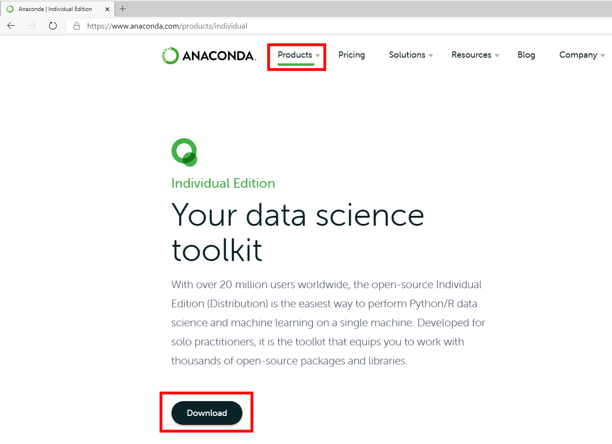
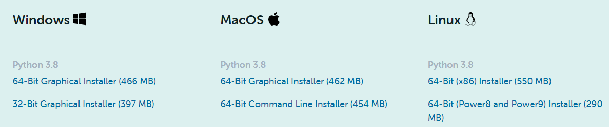
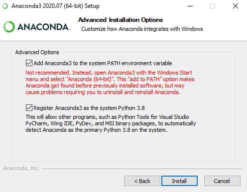
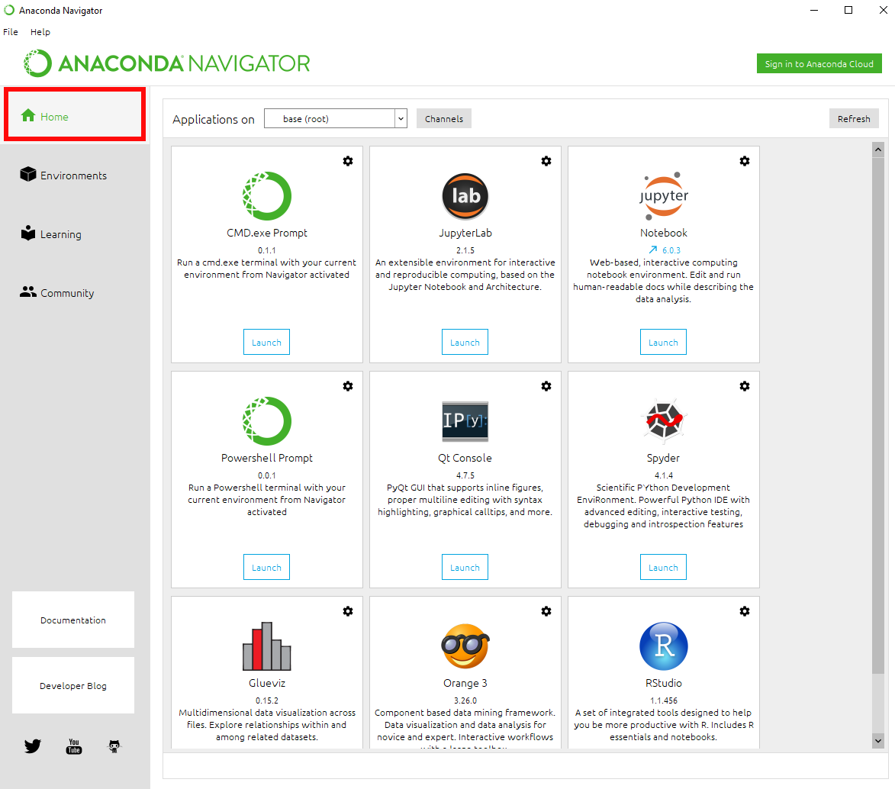
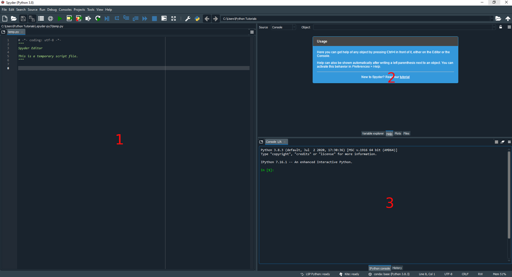
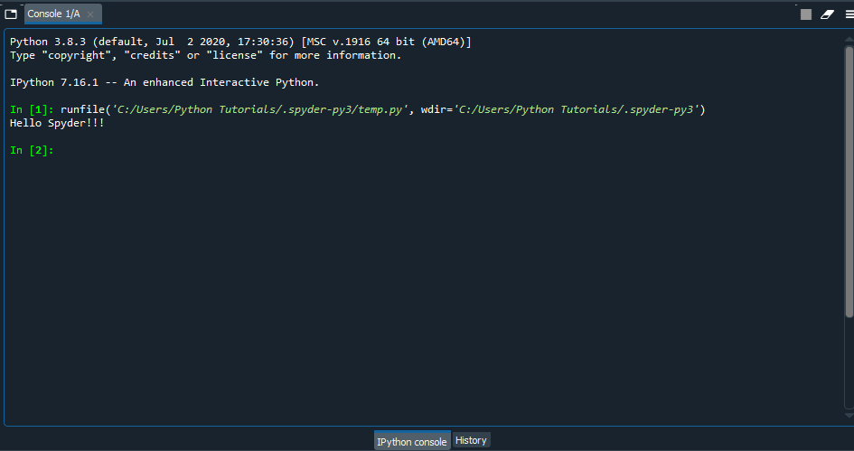
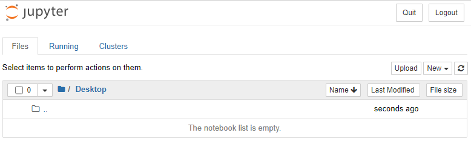
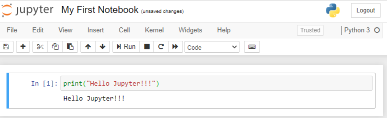
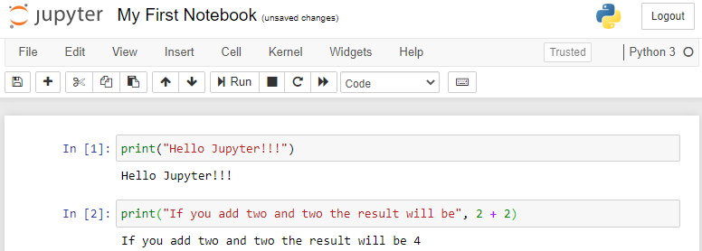

# Installation and Basic Usage

## Install Anaconda3

We will be using [Anaconda](https://www.anaconda.com/) as Python environment.
Before starting with the tutorials, you need to install Python and setup the environment itself.

First of all navigate to the [Anaconda](https://www.anaconda.com/) website, and choose the "Download" option.





1. Download the appropriate version of the installer.
  Generally, most modern computers support 64-bit version, so I suggest going with that.
2. Run the installer and make sure the __"Add Anaconda3 to the system PATH environment variable"__ is selected.
  All other options could be left as default.

  


## Anaconda Navigator

Now that the Anaconda is installed, start the __"Anaconda Navigator"__ application.

### Navigator Home

The home tab is the first thing it opens.



There are multiple applications under the __"Home"__ tab.

### Navigator Environments

Anaconda uses what is called virtual environments.
Every environment is independent from all other ones.
This is commonly used in case you want to have a fresh python setup for your new project.
However, for the current exercises, you won't need to create additional environments.

## Anaconda Navigator -- Spyder

__"Spyder"__ is an application that you will be using a lot to write your applications.
From the home menu select the __"Spyder"__ lauynch button, which starts the application.

__Note:__ If asked to install the "Kite" application, approve it -- it will help with writing basic code.

The main Spyder window has 3 subwindows as marked in the image below



The subwindows are:

1. Main editor window -- you can write all your files here.
  That way you can utilize the tooltips provided by the Kite
2. The support window which has multiple options
    1. Variable explorer -- shows the variables that were defined in your code
    2. Help -- any help items will show up here
    3. Plots -- if your code is drwaing any plots/pictures, they will show here
    4. Files -- file explorer
3. Interactive python window -- in case you want to use python directly without writing a script file.

---

**Task**

In the left `Spyder` window clear everything, and add this line:

```python
print("Hello Spyder!!!")
```

Run the program by pressing the green triangle on the top.
Your result should look like something shown below



---

## Anaconda Navigator -- Jupyter Notebook

__"Jupyter Notebook"__ is another application that is very popular with python enthusiasts.
It is often used to separate the python scripts into "cells" with each cell being executed separately.

From the home menu select the __"Notebook"__ launch button, which opens the browser window showing your home directory.



1. On the top right hand side, there is a dropdown menu labeled "New".
Create a new Notebook with the Python 3.
2. On the top left side of the notebook you will see the notebook's name "Untitled".
  Click on it to rename.
3. In the first line of the notebook, type `print("Hello Jupyter!!!")`
4. Save your notebook by either clicking on the save icon or by selecting File->Save As, and giving the notebook a name.
5. Run your notebook by selecting Cell->Run All from the drop-down menus.
  

---

**Task**

1. In the same notebook, create a new cell by pressing "Shift + Enter" on the first cell.
2. Add the following code to the newly created cell
  ```python
  print("If you add two and two the result will be", 2 + 2)
  ```
3. Run the notebook




---

_Close the jupyter notebook and the navigator to conclude this section_
